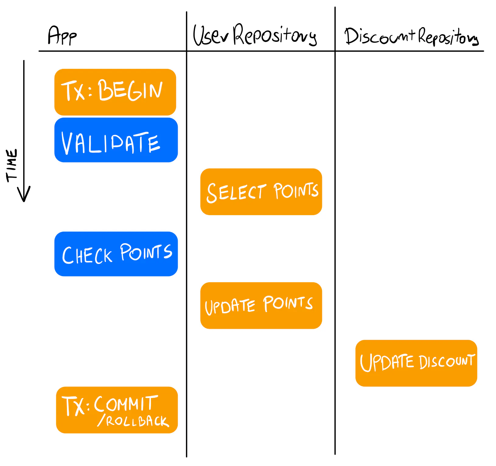

## Summary

- Anti-pattern: Transactions mixed with logic

Avoid mixing transactions with your application logic. It’s challenging to grasp how it works, test the logic, and debug issues.

- This is simple approach, but raise a lot of concern regarding source code decoupling.

ref https://threedots.tech/post/database-transactions-in-go/

