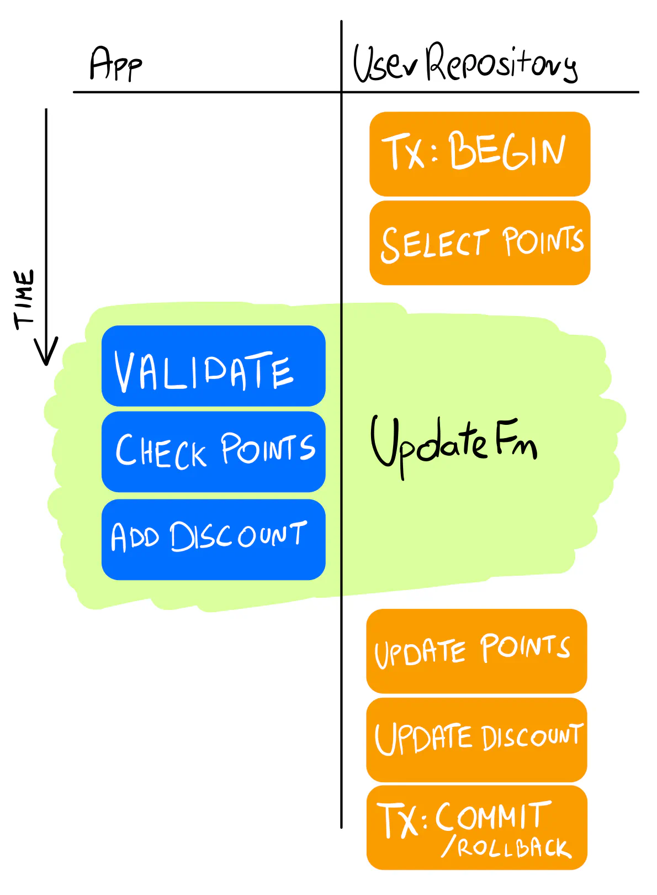

Summary 

- Encapsulate/hiding struct attributes, and exposed them via receiver methods.
- Data manilulation stays in service layer.
- The Repository only handles update the data with universal UpdateFn() function.
- It needlessly updates all the fields even if they didn’t change (for example, the email in the example above).

Unless you’re saving huge datasets or dealing with massive scale, it shouldn’t really matter. You could track which fields changed and update only these, but it will likely only complicate your architecture with no actual performance gains. Be pragmatic and avoid premature optimization. If in doubt, run stress tests.

