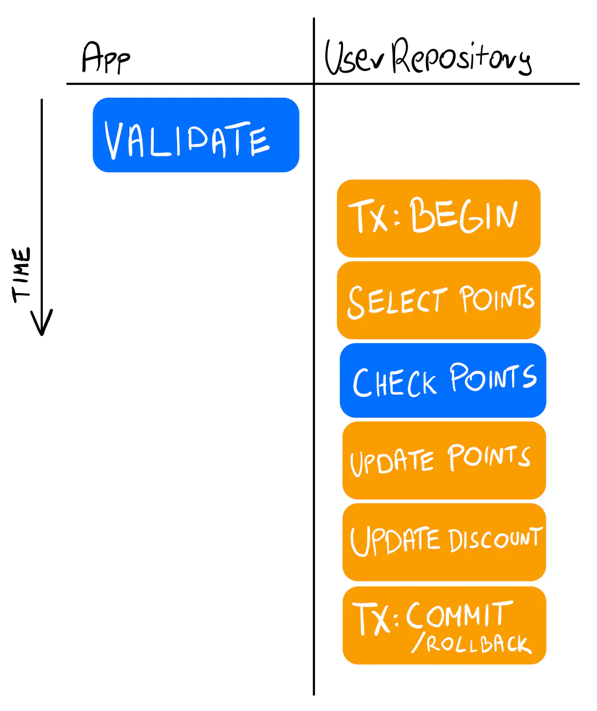

Summary 

- View repository as domain-driven's Aggregate. An aggregate is an entity, composed of more granular SQL tables, that related to the specific domain. 

- A log of logic heavily bound to the repository. While it left the Service layer very concise, it masks all the business logic behind the repo.

- Anti-pattern: One repository per database table

Don’t create a repository for each database table. Instead, think of the data that needs to be transactionally stored together.

Reference
- [Database Transactions in Go with Layered Architecture](https://threedots.tech/post/database-transactions-in-go/)
  - Case 01, 02, 03, 04

